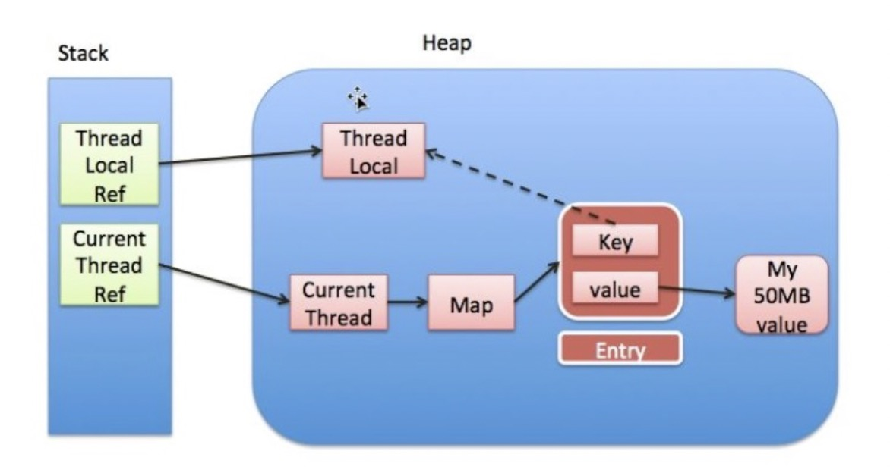

# ThreadLocal内存泄露

## 基本点

+ 每个Thread内部都有一个ThreadLocalMap
+ Map里面存储线程本地对象ThreadLocal（key）和线程的变量副本（value）
+ Thread内部的Map是由ThreadLocal维护，ThreadLocal负责向map获取和设置线程的变量值。
+ 一个Thread可以有多个ThreadLocal
+ TheadLocal.set时会将键值对加入到当前线程的TheadLocalMap里
+ ThreadLocal本身并不存储值，它只是作为一个key来让线程从ThreadLocalMap获取value

## ThreadLocal为什么会内存泄露

ThreadLocal内存泄漏的根源是：由于ThreadLocalMap的生命周期跟Thread一样长，如果没有手动删除对应key就会导致内存泄漏，而不是因为弱引用。弱引用只是保证在TheadLcoal对象在没有外部引用时，下一次GC时能够被及时回收，并不能保证Entry被回收。

也就是说，在请求数足够大的情况下，如果线程里的threadLocal变量没有remove，那么value会一直存在于线程的ThreadLocalMap里。特别是针对线程池的情况，核心线程不会被销毁。

## 避免内存泄露的方法

每次使用完ThreadLocal，都调用它的remove()方法，清除数据。清理逻辑放在finally。

减少对ThreadLocal的使用，非必要不使用。

## 参考

https://developer.aliyun.com/article/689656

